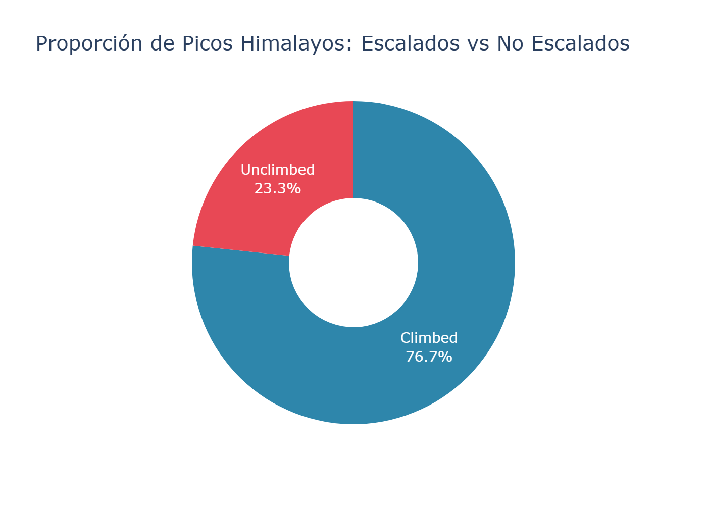
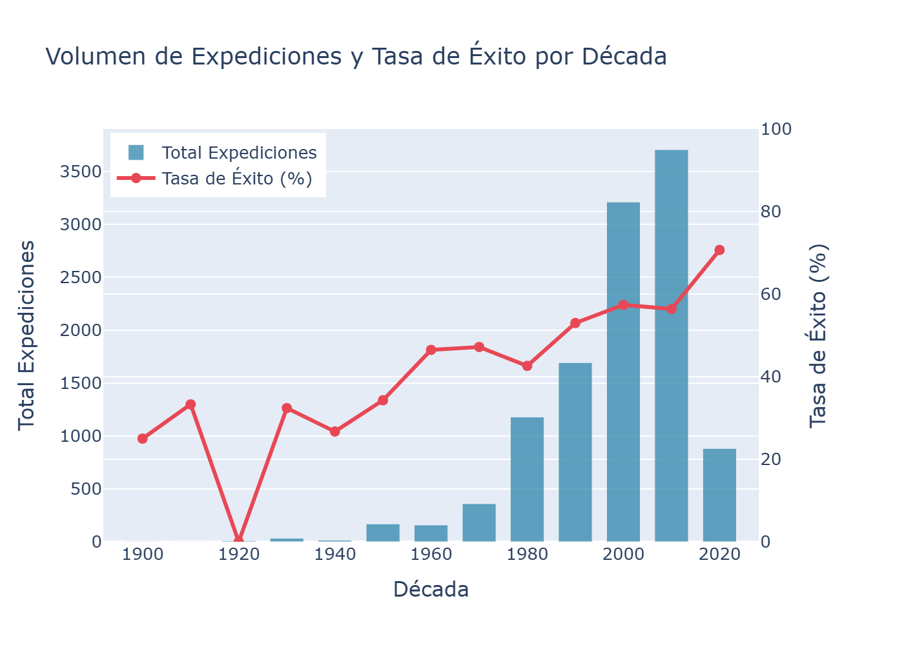
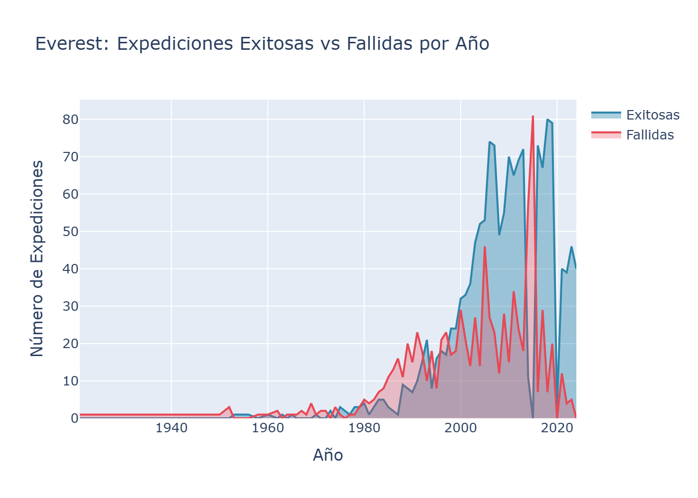
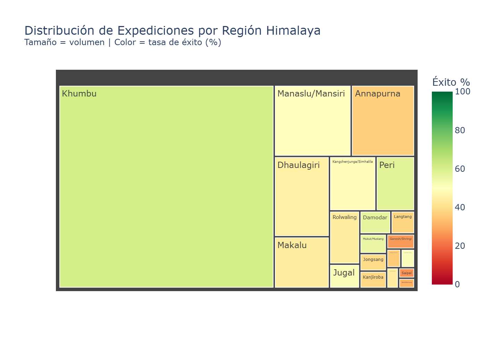

# Expediciones Himaláyicas (1905–2024)

Análisis de 120 años de alpinismo: 11 562 expediciones, 481 picos y 89 391 escaladores procesados con Python para responder cuatro preguntas sobre conquista, élites, tendencias históricas y el Everest.

---

## Objetivo

Responder cuatro preguntas analíticas sobre la historia del montañismo en el Himalaya:
1. ¿Qué porcentaje de los 481 picos ha sido escalado al menos una vez?
2. ¿Quiénes son los escaladores con más cumbres exitosas y de qué países provienen?
3. ¿Cómo han evolucionado el volumen de expediciones y la tasa de éxito por décadas?
4. ¿Cómo ha cambiado la tasa de éxito en el Everest y qué impacto tiene el oxígeno suplementario?

---

## Problema / Contexto

La Himalayan Database reúne registros de campo levantados durante décadas por la periodista Elizabeth Hawley, cubriendo prácticamente toda la actividad de alpinismo de altitud desde inicios del siglo XX. El dataset es rico pero heterogéneo: múltiples tablas relacionales, campos con nulos que representan falsos negativos lógicos y formatos de texto inconsistentes en ciudadanías. El reto fue transformar esos datos en un análisis coherente que permita identificar tendencias y factores de éxito en condiciones extremas.

---

## Datos

| Característica | Detalle |
|---|---|
| **Fuente** | [Himalayan Database](https://www.himalayandatabase.com/) — challenge Maven Analytics |
| **Archivos** | 5 CSV: `exped.csv`, `members.csv`, `peaks.csv`, `refer.csv`, `himalayan_data_dictionary.csv` |
| **Volumen** | 11 425 expediciones · 89 000 miembros · 480 picos válidos |
| **Cobertura temporal** | 1905–2024 |
| **Tipo** | Datos relacionales tabulares; sin coordenadas geográficas (campo `himal` como proxy espacial) |

---

## Herramientas y tecnologías

| Herramienta | Uso |
|---|---|
| Python 3.x | Lenguaje principal |
| Pandas | Carga, limpieza, agregación y joins |
| Plotly | Visualizaciones interactivas y exportación a PNG |
| Jupyter Notebook | Análisis reproducible y narrativa |

---

## Metodología

```
data/raw/          →   src/data_utils.py   →   notebooks/himalayan_analysis.ipynb
(5 CSVs crudos)        (limpieza y merge)       (EDA + visualizaciones)
                                           ↓
                                   data/processed/    output/figures/
                                   (CSVs limpios)     (8 PNG exportados)
```

1. **Carga** — `load_raw_data()` lee las 4 tablas principales desde `data/raw/`.
2. **Limpieza** — Imputación de nulos lógicos (`NaN → False` en columnas de éxito), normalización de ciudadanías con `.str.title()`, estandarización de claves de join.
3. **Merge** — Join `exped ↔ peaks` por `peakid` para construir la tabla analítica maestra.
4. **Análisis y visualización** — Cada sección del notebook responde una pregunta de investigación con un gráfico Plotly exportado como PNG.

---

## Mi rol y contribución

Desarrollé el proyecto de principio a fin de manera individual:

- **Diseñé las cuatro preguntas de investigación** a partir del contexto del dataset y los criterios del challenge (Maven Analytics).
- **Construí `src/data_utils.py`**, el módulo de carga y limpieza reutilizable, separando la lógica de transformación del análisis para mantener el notebook limpio.
- **Tomé las decisiones de imputación** (tratar `NaN` como `False` en campos booleanos de éxito, normalizar ciudadanías) justificando cada criterio dentro del notebook.
- **Diseñé y generé todas las visualizaciones** con Plotly, eligiendo la codificación visual adecuada para cada pregunta: donut chart para conquista, barras horizontales para élites, área apilada para Everest, treemap para distribución regional.
- **Redacté las conclusiones** de cada sección y el resumen final de hallazgos.

---

## Resultados e insights clave

| Análisis | Hallazgo |
|---|---|
| **Conquista** | 368 de 480 picos escalados (76,7%); 112 (23,3%) sin ninguna ascensión registrada |
| **Élites** | Los Sherpas nepaleses dominan el ranking: Jangbu Sherpa (170 cumbres), Pasang Sherpa (165), Lhakpa Nuru Sherpa (158) |
| **Tendencias** | La tasa de éxito creció de ~30% en las décadas tempranas a >55% en los 2000, impulsada por comercialización y mejoras tecnológicas |
| **Everest** | 2 347 expediciones (1921–2024), tasa global del 63%; el uso de oxígeno suplementario mejora significativamente las probabilidades de cumbre |
| **Regional** | Khumbu (región del Everest) concentra el mayor volumen; zonas remotas presentan tasas de éxito sensiblemente menores |

### Visualizaciones

| Conquista de picos | Tendencias por década |
|:---:|:---:|
|  |  |

| Línea de tiempo del Everest | Distribución regional |
|:---:|:---:|
|  |  |

---

## Cómo ejecutar

```bash
# 1. Instalar dependencias
pip install -r requirements.txt

# 2. Abrir el notebook
jupyter notebook notebooks/himalayan_analysis.ipynb

# 3. Kernel → Restart & Run All
```
